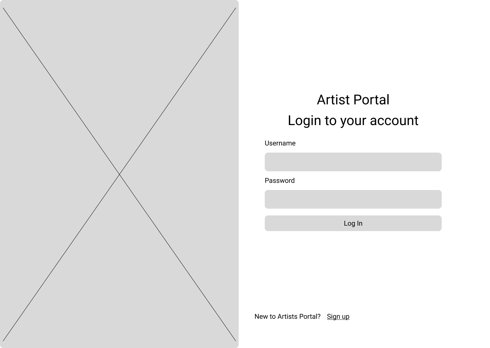

<br><br>

<!-- project philosophy -->


> A mobile app that mixes songs based on the user's mood.
>
> Pocket DJAI aims to produce a continuous flow of songs mixed based on Mood, Camelot ,Beat and Danceability.

### User Stories
- As a user I want to register so that I have an account on the website.
- As a user I want to log in so that i can benefit from playing the full songs.
- As a user I want to choose the genre and the mood of the songs so that I can listen to what I want.
- As a user I want to be able to save the remixes generated so that I can use them in the future.
- As a user I want to be able to play, stop and pause the songs so that I can control the flow.
- As a user I want to be able to search songs and artists so that I can pick any song / artist I want.
- As an artist I want to upload songs so that I can add my songs to my profile.
- As an artist I want to have a profile so I can link my social media platforms.
- As an artist I want to be able to view all my songs so that I can edit them.
- As an admin I want to upload songs so that I can add to the songs library.
- As an admin I want to approve songs uploaded by the artists so that I can manage the data on the app.
- As an admin I want to view all the songs uploaded so that I can monitor my data.
- As an admin I want to view all the users so that I can monitor my registered users.

<br><br>

<!-- Prototyping -->


> We designed Pocket DJAI using wireframes and mockups, iterating on the design until we reached the ideal layout for easy navigation and a seamless user experience.

### Wireframes
| Login screen  | Register screen |  Landing screen |
| ---| ---| ---|
|  |  |  |

### Mockups
| Home screen  | Menu Screen | Order Screen |
| ---| ---| ---|
|  |  |  |

<br><br>

<!-- Implementation -->


> Using the wireframes and mockups as a guide, we implemented the Pocket DJAI app with the following features:

### User Screens (Mobile)
| Login screen  | Register screen | Landing screen | Loading screen |
| ---| ---| ---| ---|
|  |  |  |  |
| Home screen  | Menu Screen | Order Screen | Checkout Screen |
|  |  |  |  |

### Artist Screens (Web)
| Login screen  | Register screen |  Landing screen |
| ---| ---| ---|
|  |  |  |
| Home screen  | Menu Screen | Order Screen |
|  |  |  |

### Admin Screens (Web)
| Login screen  | View All Users screen |  View all Artists screen | View all Songs screen | Upload Mood screen | Upload Song screen
| ---| ---| ---| ---| ---| ---|
|  |  |  |  |  |  |
<!-- | Home screen  | Menu Screen | Order Screen |
|  |  |  | -->

<br><br>

<!-- Tech stack -->


###  Pocket DJAI is built using the following technologies:

- This project uses the [React Native app development framework](https://reactnative.dev/). React Native is a cross-platform hybrid app development platform which allows us to use a single codebase for apps on mobile, desktop, and the web.
- For persistent storage (database), the app uses the [MySQL](https://www.mysql.com/) package which allows the app to create a custom storage schema and save it to a local database.
- To create the mixes, the app uses [Django](https://www.djangoproject.com/) framework in integration with [Pydub](https://pydub.com/) which is an audio library, to generate the mix.
- The app uses the font [Urbanist](https://fonts.google.com/specimen/Urbanist) as its main font, and the design of the app adheres to the material design guidelines.
- The images of the Moods available on the app were generated using [DeepAI](https://deepai.org/machine-learning-model/text2img).
- The app is integrated with [Spotify API](https://developer.spotify.com/documentation/web-api) to retreive songs details. 

<br><br>

<!-- How to run -->


> To set up Pocket DJAI locally, follow these steps:

### Prerequisites

This is an example of how to list things you need to use the software and how to install them.
* npm
  ```sh
  npm install npm@latest -g
  ```

### Installation

_Below is an example of how you can instruct your audience on installing and setting up your app. This template doesn't rely on any external dependencies or services._

1. Get a free API Key at [Spotify API](https://developer.spotify.com/documentation/web-api)
2. Clone the repo
   ```sh
   git clone https://github.com/aliynajjar/pocket_dj.git
   ```
3. Install NPM packages
   ```sh
   npm install
   ```
4. Enter your API in `config.js`
   ```js
   const API_KEY = 'ENTER YOUR API';
   ```

Now, you should be able to run Pocket DJAI locally and explore its features.