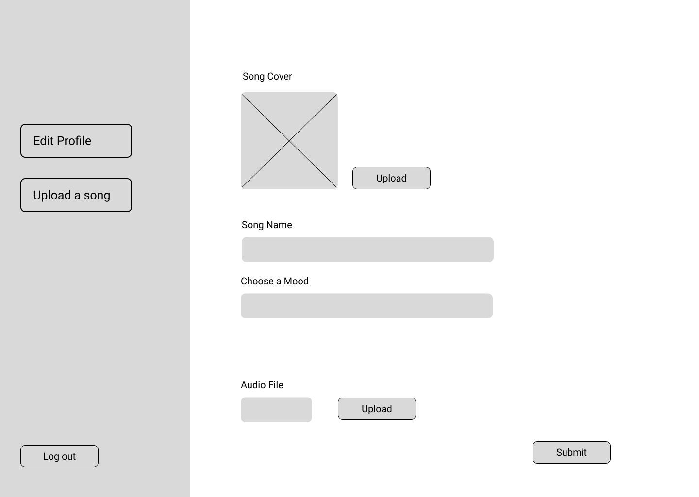
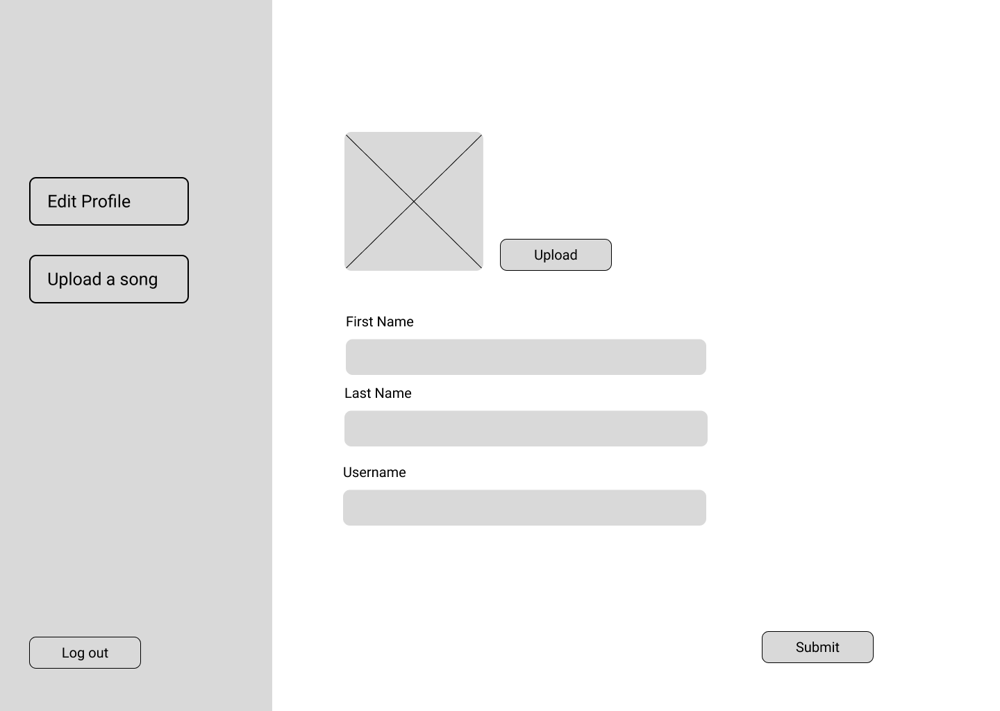
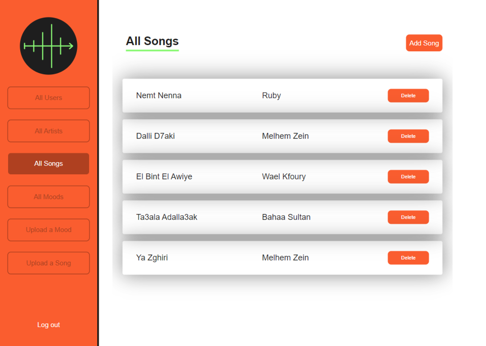
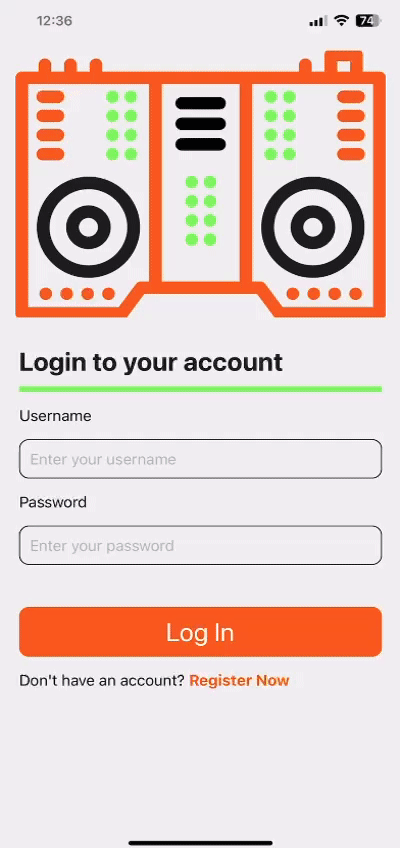

<br><br>

<!-- project philosophy -->


> A mobile app that mixes songs based on the user's mood.
>
> Pocket DJAI aims to produce a continuous flow of songs mixed based on Mood, Camelot ,Beat and Danceability.

### User Stories
- As a user I want to choose the mood of the songs so that I can listen to what I want.
- As a user I want to be able to save the remixes generated so that I can use them in the future.
- As a user I want to be able to play, stop and pause the songs so that I can control the flow.
- As a user I want to be able to search songs and artists so that I can pick any song / artist I want.

### Artist Stories
- As an artist I want to upload songs so that I can add my songs to my profile.
- As an artist I want to have a profile so I can edit my information.
- As an artist I want to be able to view all my songs so that I can edit them.

### Admin Stories
- As an admin I want to upload songs so that I can add to the songs library.
- As an admin I want to view all the songs uploaded so that I can monitor my data.
- As an admin I want to view all the users so that I can monitor my registered users.
- As an admin I want upload moods so that I can add to the moods library.
- As an admin I want to view all the moods uploaded so that I can monitor my data.

<br><br>

<!-- Prototyping -->


> We designed Pocket DJAI using wireframes and mockups, iterating on the design until we reached the ideal layout for easy navigation and a seamless user experience.

### Wireframes Mobile
| Login screen  | Register screen |  Landing screen | Search screen  | Remixes screen |  Player screen |
| ---| ---| ---| ---| ---| ---|
|  |  |  |  |  |  |

### Wireframes Frontend Artist
| Login screen  | Register screen |  Landing screen | Profile Screen
| ---| ---| ---| ---|
|  |  |  |  |

### Wireframes Frontend Admin
| Login screen  | View All Artists screen |  View All Users screen | View All Songs screen | View All Moods screen  | Upload Song screen |  Upload Mood screen |
| ---| ---| ---| ---| ---| ---| ---|
|  |  |  |  |  |  |  |
 

### Mockups Mobile
| Login screen  | Register screen | Moods screen | Search screen  | Song Player Screen | Remixes Screen |
| ---| ---| ---| ---| ---| ---|
|  |  | |  |  |  |  |

### Mockups Artist Frontend
| Login screen  | Register screen |  Upload Song screen | Edit Profile screen
| ---| ---| ---| ---|
|  |  |  |  |


### Mockups Admin Frontend
| Login screen  | View All Users screen |  View all Artists screen | View all Songs screen | View all Moods | Upload Mood screen | Upload Song screen |
| ---| ---| ---| ---| ---| ---| ---|
|  |  |  |  |  |  | 

<br><br>

<!-- Implementation -->


> Using the wireframes and mockups as a guide, we implemented the Pocket DJAI app with the following features:

> Pocket DJAI GIFs:

### User Screens (Mobile)
| Loading screen | Login screen | Register screen | Song Player Screen |
| ---| ---| ---| ---|
|  |  |  | ||
| Search screen  | Moods screen | Remixes Screen | Profile Screen |
|  |  |  |  |

### Landing Screen (Web)
| Login screen  |
| ---| 
|  | 

### Artist Screens (Web)
| Login screen  | Register screen |  Upload Song screen | Edit Profile screen
| ---| ---| ---| ---|
|  |  |  |  |


### Admin Screens (Web)
| Login screen  | View All Users screen |  View all Artists screen | View all Songs screen | 
| ---| ---| ---| ---|
|  |  |  |  |
|View all Moods | Upload Mood screen | Upload Song screen |
|  |  | 

<br><br>

<!-- Tech stack -->


###  Pocket DJAI is built using the following technologies:

- This project uses the [React Native app development framework](https://reactnative.dev/). React Native is a cross-platform hybrid app development platform which allows us to use a single codebase for apps on mobile, desktop, and the web.
- For persistent storage (database), the app uses the [MySQL](https://www.mysql.com/) package which allows the app to create a custom storage schema and save it to a local database.
- To create the mixes, the app uses the [Django](https://www.djangoproject.com/) framework in conjuction with [Pydub](https://pydub.com/), an audio library, to generate mixes.
- In terms of design, the app uses the [Urbanist](https://fonts.google.com/specimen/Urbanist) font and adheres to material design guidelines.
- The images of the Moods available on the app were generated using [DeepAI](https://deepai.org/machine-learning-model/text2img).
- The app also integrates with the [Spotify API](https://developer.spotify.com/documentation/web-api) to retreive song details. 

<br><br>

<!-- How to run -->


> To set up Pocket DJAI locally, follow these steps:

### Installation

1. Get a free API Key at [Spotify API](https://developer.spotify.com/documentation/web-api)
2. Clone the repo
   ```sh
   git clone https://github.com/ali-al-najjar/pocket_dj
   ```
3. Frontend: Open a command prompt and navigate inside pocketdj_frontend folder to install NPM packages
   ```sh
   npm install
   ```
   Create a `.env` file inside the folder
   Enter your Spotify keys and your server url
   ```js
   REACT_APP_CLIENT_KEY= 'Enter your client key'
   REACT_APP_CLIENT_SECRET = 'Enter your secret key'
   REACT_APP_API_URL = 'Enter your URL'
   ```
4. Mobile: Open a command prompt and navigate inside pocketDJ_mobile folder to install NPM packages
   ```sh
   npm install
   ```
5. Backend: Open a command prompt and navigate inside pocketDJ_server folder to install Django packages 
   ```sh
   pip install -r requirements.txt
   ```
   Create a `.env` file inside the folder
   Enter your database credentials
   ```js
      DATABASE_ENGINE=django.db.backends.mysql
      DATABASE_NAME='database_name'
      DATABASE_USER='database_username'
      DATABASE_PASSWORD='database_password'
      DATABASE_HOST='127.0.0.1' #for local environment
      DATABASE_PORT='database_port'

      BASE_URL='your base url' 
      SECRET_KEY = 'you django secret keye'
   ```
   To generate a django secret key.
   ```python
      python
      from django.core.management.utils import get_random_secret_key
      print(get_random_secret_key())
   ```
   To prepare the database:
   ```python
      python manage.py makemigrations
      python manage.py migrate

### Initialization
1. Frontend: Inside the pocketdj_frontend folder
   ```npm
   npm start
   ```
2. Mobile: Inside the pocketDJ_mobile folder
   ```npm
   npx expo start
   ```
3. Backend: Inside the pocketDJ_server folder
   ```python
   python manage.py runserver
   ```
Now, you should be able to run Pocket DJAI locally and explore its features.